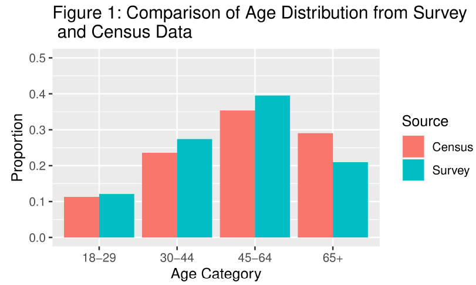
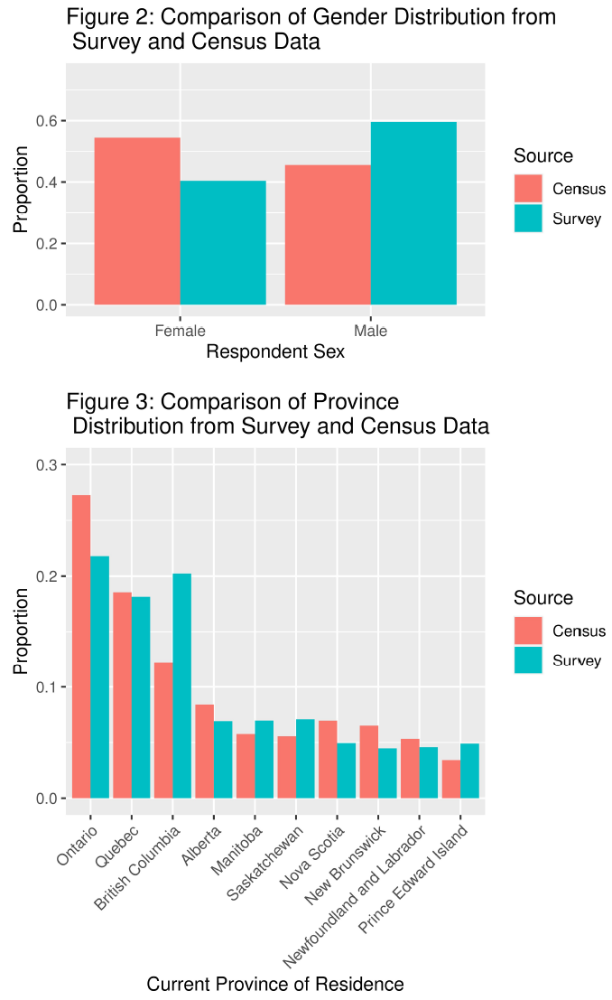
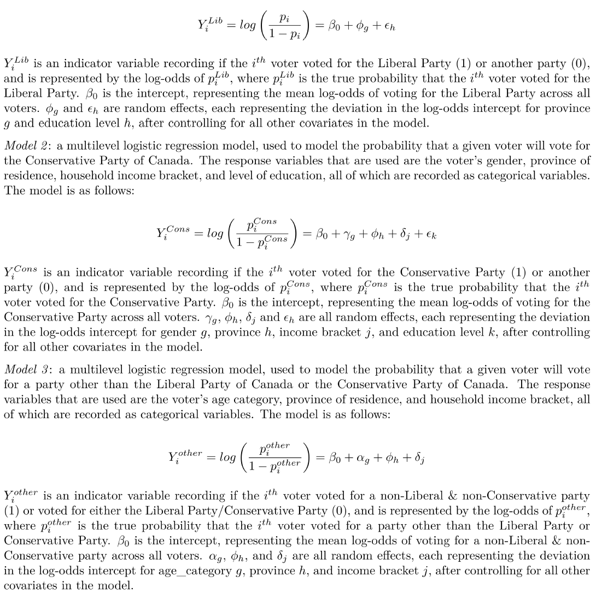
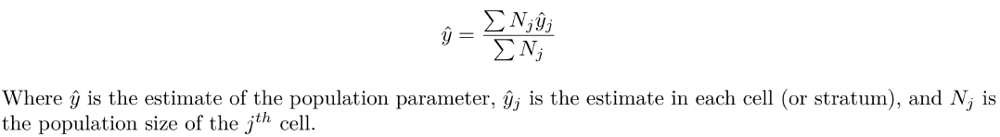

# 2025 Election Forecast using Non-representative Survey Data

# Introduction

Election forecasting is an important tool that can be used to predict the outcome of an electoral race ahead of the polling date. Information about which candidate is favoured to win an election is incredibly valuable to many stakeholders, including media outlets, campaign managers, and most cruicially, to voters themseleves. Creating polls that sample a representative segment of the target population is often the greatest logistical barrier to accurate and unbiased election forecasting, and requires considerable time and effort.

In this report, we hypothesize that an representative election forecast can be generated by using a census to post-stratify model results from a non-representative survey sample. We obtain voting preferences from a large-scale 2019 phone survey, which also collected detailed demographic information. We also use 2016 census data representative of the Canadian voter population in order to reweight model results in a representative manner.  

If elections can be accurately forecast by using non-representative datasets, poll predictions can be made more quickly, and with less resources required. This is important because election information is very time sensitive, so the ability to generate nuanced and timely election predictions is of high value, from both a practical and academic perspective.

# Data

## Data Cleaning
```
survey_data <- 
  survey_og_data %>% 
  mutate(vote_liberal = ifelse(q11==1, 1, 0),
         vote_conservative = ifelse(q11==2, 1, 0),
         vote_other = ifelse(q11==3|q11==4|q11==5|q11==6|q11==7, 1, 0),
         gender = case_when(
           q3==1 ~ "Male",
           q3==2 ~ "Female"),
         current_province = case_when(
           q4==1 ~ "Newfoundland and Labrador",
           q4==2 ~ "Prince Edward Island",
           q4==3 ~ "Nova Scotia",
           q4==4 ~ "New Brunswick",
           q4==5 ~ "Quebec",
           q4==6 ~ "Ontario",
           q4==7 ~ "Manitoba",
           q4==8 ~ "Saskatchewan",
           q4==9 ~ "Alberta",
           q4==10 ~ "British Columbia"),
         party_vote = case_when(
           q11==1 ~ "Liberal (Grits)",
           q11==2 ~ "Conservatives (Tory, PCs, Conservative Party of Canada)",
           q11==3 ~ "Other",
           q11==4 ~ "Other",
           q11==5 ~ "Other",
           q11==6 ~ "Other",
           q11==7 ~ "Other"),
         income_family = case_when(
           (q69 < 24999 & q69 > -1) ~ "Less than $25,000",
           (q69 < 49999 & q69 > 25000) ~ "$25,000 to $49,999",
           (q69 < 74999 & q69 > 50000) ~ "$50,000 to $74,999",
           (q69 < 99999 & q69 > 75000) ~ "$75,000 to $99,999",
           (q69 < 124999 & q69 > 100000) ~ "$100,000 to $ 124,999",
           (q69 > 125000) ~ "$125,000 and more"),
         age_category = case_when(
           (age > 17 & age < 30) ~ "18-29",
           (age > 29 & age < 45) ~ "30-44",
           (age > 44 & age < 65) ~ "45-64",
           (age > 64) ~ "65+"),
         education = case_when(
           (q61 == 1 | q61 == 2 | q61 == 3 | q61 == 4 | q61 == 5 | q61 == 6 | q61 == 7 | q61 == 8) ~ "No completed post-secondary education",
           (q61 == 9 | q61 == 10 | q61 == 11) ~ "Completed post-secondary education")
        ) %>% 
  select(gender, current_province, party_vote, income_family, age_category, 
         education, vote_liberal, vote_conservative, vote_other)
survey_data = na.omit(survey_data)

survey_data$income_family <- factor(survey_data$income_family,
                                    levels = c("Less than $25,000",
                                                             "$25,000 to $49,999",
                                                             "$50,000 to $74,999",
                                                             "$75,000 to $99,999",
                                                             "$100,000 to $ 124,999",
                                                             "$125,000 and more"))
survey_data$age_category <- factor(survey_data$age_category,
                                   levels = c("18-29",
                                              "30-44",
                                              "45-64",
                                              "65+"))
survey_data$education <- factor(survey_data$education,
                                levels = c("No completed post-secondary education",
                                           "Completed post-secondary education"))
```

### Survey Data

Analysis was performed on the publicly available [2019 Canadian Election Study (CES) data](https://dataverse.harvard.edu/dataset.xhtml?persistentId=doi:10.7910/DVN/8RHLG1), which is collected annually and includes questions about past voting behaviour, as well as many demographic factors. The survey was administered over the phone during the campaign and post-election period, and sampled Canadian citizens and permanent residents over 18 years of age. Detailed sampling techniques can be found in the “2019 Canadian Election Study - Online Survey Technical Report and Codebook”. The original, uncleaned data contains 4,021 observations of 273 variables.

In the survey data's original state, each variable is named after its question code (q1, q2, p1, p2, etc). Thus, the cleaning process began with identifying important variables and modifying variable names for convenience and clarity. Each of the selected variables have been renamed to better describe the information being collected.
The table below displays the important variables from the survey data after the names have been changed.

Furthermore, the responses to each question in the survey data are coded as numbers, each representing a specific answer that can be found in the survey data documentation. This is not ideal for this report, so the responses for variables *gender*, *current_province* and *party_vote* are modified
in order to directly display the individual's response as its entire a string representation.

In addition, the income family variable is modified so that it is a categorical value
with 6 categories that correspond with the family income categories in the cleaned
census data. A new variable is also created in order to display and categorize the age 
of the respondent into one of four age groups. As well, the education variable is 
modified in order to only show whether the individual has achieved a Bachelor's 
degree or not. Following that, 3 binary variables are created based on *party_vote* to indicate an individual's likely votes for the Liberal, Conservative and 'Other' parties. Lastly, any observations with a N/A in any variable is removed. 

The newly cleaned data set contains 1923 observations and 9 variables. Below are the final cleaned variables from the survey data.

*age_category*: Age bracket of the individual. Categorical variable.\
*gender*: Gender of the individual. Categorical variable.\
*current_province*: "Current Canadian province the individual resides in. Categorical variable.\
*party_vote*: The political party that the individual claimed they would vote for. Categorical variable.\
*income_family*: The total household income bracket of the individual, before taxes. Categorical variable.\
*education*: Whether or not the individual has completed post-secondary education. Binary variable.\
*vote_liberal*: Whether or not the individual is likely to vote Liberal. Binary variable.\
*vote_conservative*: Whether or not the individual is likely to vote Conservative. Binary variable.\
*vote_other*: Whether or not the individual is likely to vote NDP, Bloc, Green or other parties. Binary variable.

One additional thing to note that is that while Gender is not limited to female and male in the survey, there is only 1 observation out of 1923 observations for "Other" in the *gender* variable. Thus, that observation was excluded as there is an insufficient sample size to draw any meaningful conclusions for those in the "Other" category.

### Census Data
[The data used as the census data comes from the 2017 General Social Survey (GSS)](https://sda-artsci-utoronto-ca.myaccess.library.utoronto.ca/legacy_sda/dli2/gss/gss31/gss31/more_doc/index.htm) that was conducted
between February to November 2017. The goal of the survey was to gather and view the changes
in the quality of life of Canadians as well as provide a general census on current
issues.
It targeted non-institutionalized people above the age of 15 that resided in a Canadian
province. The data collection process was done through telephone calls, in which telephone 
numbers were retrieved from the Address Register provided by Statistics Canada. 
The data itself contains 20,602 observations of 81 variables. 

```
census_og_data <- read.csv("gss_clean.csv")

census_data <- census_og_data %>%
  select(age, sex, province, income_family, education)
census_data = na.omit(census_data)
census_data <- subset(census_data, census_data$age > 17) 
census_data <- census_data %>% mutate(age = floor(age),
                                      age_category = case_when(
                                        (age > 17 & age < 30) ~ "18-29",
                                        (age > 29 & age < 45) ~ "30-44",
                                        (age > 44 & age < 65) ~ "45-64",
                                        (age > 64) ~ "65+"),
                                      education = case_when(
                                        (education == "High school diploma or a high school equivalency certificate" |
                                         education == "Trade certificate or diploma" |
                                         education == "Less than high school diploma or its equivalent" |
                                         education == "College, CEGEP or other non-university certificate or di..." |
                                         education == "University certificate or diploma below the bachelor's level") ~
                                          "No completed post-secondary education",
                                        (education == "Bachelor's degree (e.g. B.A., B.Sc., LL.B.)" | 
                                         education == "University certificate, diploma or degree above the bach...") ~
                                          "Completed post-secondary education"))

census_data <- census_data %>%
  select(age_category, sex, province, income_family, education)

census_data$income_family <- factor(census_data$income_family,
                                    levels = c("Less than $25,000",
                                                             "$25,000 to $49,999",
                                                             "$50,000 to $74,999",
                                                             "$75,000 to $99,999",
                                                             "$100,000 to $ 124,999",
                                                             "$125,000 and more"))
census_data$age_category <- factor(census_data$age_category,
                                   levels = c("18-29",
                                              "30-44",
                                              "45-64",
                                              "65+"))
census_data$education <- factor(census_data$education,
                                levels = c("No completed post-secondary education",
                                           "Completed post-secondary education"))
```

The cleaning process begins with selecting the variables that are relevant to our report.
Following, all observations with an N/A response in any of the variables are removed 
as well as observations where the individual is a minor (under the age of 18). The 
age variable is then rounded down in order to obtain a whole number. Subsequently, 
a new variable is created, which separates the observations into 4 age groups. 
Lastly, while the education variable provided by the census data offers in detail 
the highest certificate, diploma or degree achieved by the individual, that variable
is updated in order to only display whether the individual has achieved a Bachelor's degree.
The newly cleaned data set contains 19978 observations and 5 variables.
Below are the final variables that originate from the census data.

*age_category*: Age bracket of the individual. Categorical variable.\
*gender*: Gender of the individual. Categorical variable.\
*province*: "Current Canadian province the individual resides in. Categorical variable.\
*income_family*: The total household income bracket of the individual, before taxes. Categorical variable.\
*education*: Whether or not the individual has completed post-secondary education. Binary variable.

## Exploratory Data Analysis

  The survey data was relatively representative of the general Canadian population, estimated by the 2016 census information.  Figure 1 compares the age distribution of census and survey respondents, which are both approximately normally distributed and centered around 50 years of age. Figure 2 compares the relative proportion of respondents of each gender. There was a slightly higher proportion of female respondents in the census (54%) compared to a higher proportion of males in the survey (58%). Figure 3 shows the distribution of the provinces respondents resided in at the time of the survey. Notably, respondents from Ontario appear underrepresented in the survey (27% in the census and 21% in the survey), while respondents from British Columbia appear over represented (12% in the census and 19% in the survey). The income and education distributions of survey respondents appears to be right-skewed compared to the census data, with a higher proportion of survey respondents having a family income of greater than $125,000 and having completed a minimum of a Bachelor’s degree (Figure 4). Detailed information about respondent demographics of survey and census takers, as well as the comparative distributions of respondent education levels, can be found in the Appendix.  While survey data appears to be generally representative of the Canadian electorate, there are demographic differences that, if left uncorrected, could lead to election forecasting that would be biased and ungeneralizable to the Canadian population at large. [This is supported by political science research](https://www.thecanadianencyclopedia.ca/en/article/electoral-behaviour) that suggests that demographic variables such as gender, age, geography, education and income are influential determinants of political ideology.

Preliminary data analysis revealed trends to be considered when selecting variables to be included in the election model. Several demographic variables appeared to influence voting ideology. Specifically, a greater proportion of Conservative voters were males (70%), compared to Liberal voters (56%). Similarily,  Conservative voters far outweighed Liberal voters in Alberta, Manitoba and Saskatchewan. Conservatives voters comprised a greater proportion of voters in the 65+ years of age category, voters earning an annual family income of greater than $125,000, and voters who had not completed any post-secondary education. This exploratory data analysis indicates that demographic factors may be predictors of political ideology, and vote, and should be included when modeling voting behaviour. 

<p align="center">
  
</p>

<p align="center">
  
</p>

<p align="center">
  
</p>

## Methods

In this section, the survey data will be used to build three regression models, each with the goal of predicting whether or not a given voter will vote for a given Canadian political party. The estimates of these models will then be adjusted by post-stratification on census data in order to predict the overall popular vote of the 2025 Canadian federal election.

All analysis for this report was programmed using R version 4.0.2. using packages OpenIntro, tidyverse, Knitr, cesR & lme4.

### Model Specifics

Given that the objective of this analysis is to predict the overall outcome of the 2025 Canadian federal election, we choose to approximate this result by estimating the probabilities that a given voter votes for given parties. A voter can either choose to vote for a party, or to not vote for the party. Thus, there are two distinct scenarios for each party. A logistic regression is suited for this, as its dependent variable is binary. Knowing this, we create several logistic regression models for the various parties.

In addition, while we expect certain groupings of voters to vote differently, the effects of each group can vary, and are expected to be different between each group. We are not particularly interested in inferring how these different effects affect the outcome, rather we are interested in accounting for the influence of these effects in our models. Thus, we do so by incorporating random effects for each group in our models, resulting in two levels of parameters, and hence have a multilevel model.

We make the following assumptions in all of the models:
  1. The response variable is binary (two possible responses).
  2. The observations must be independent of one another.
  3. The log of the odds ratio must be a linear function with respect to fixed effects.
  4. Random effects follow a normal distribution with mean 0 and an estimated variance parameter.
  
We have already established that the response variable in each model has only two possible outcomes, verifying assumption 1. While there is little reason for observations to be correlated, it can be argued that family members can influence each others' political opinions. Acknowledging this potential caveat, this analysis will be carried out under assumption 2 being true. Regarding assumption 3, our models do not actually contain fixed effects, so this assumption holds. Assumption 4 holds true as there is little reason why any of the included random effects would significantly deviate from zero. We verify that this assumption is true in each regression model.

All three models were selected through backwards stepwise selection. Each model selection process began with a 'full model' containing all predictors under consideration. For each model, this included age category, gender, province, household income bracket, and education. These variables were initially selected because they could all be argued to have an influence a voter's vote. The next step was to remove the least significant predictor, determined by the highest p-value, then reevaluate the model. This step was repeated until all remaining predictors were statistically significant at the 0.05 level. The models that resulted from this process are described below.

<p align="center">
  
</p>


```
library(lme4)

Model 1 - Liberal Vote Multilevel Logistic Regression

Beginning with the full model
lib_model_full <- lme4::glmer(vote_liberal ~ (1|age_category) + (1|gender) + (1|current_province) + (1|income_family) + (1|education), family=binomial, data=survey_data)

Try removing one predictor
lib_model_1a <- lme4::glmer(vote_liberal ~ (1|gender) + (1|current_province) + (1|income_family) + (1|education), family=binomial, data=survey_data)
lib_model_1b <- lme4::glmer(vote_liberal ~ (1|age_category) + (1|current_province) + (1|income_family) + (1|education), family=binomial, data=survey_data)
lib_model_1c <- lme4::glmer(vote_liberal ~ (1|age_category) + (1|gender) + (1|income_family) + (1|education), family=binomial, data=survey_data)
lib_model_1d <- lme4::glmer(vote_liberal ~ (1|age_category) + (1|gender) + (1|current_province) + (1|education), family=binomial, data=survey_data)
lib_model_1e <- lme4::glmer(vote_liberal ~ (1|age_category) + (1|gender) + (1|current_province) + (1|income_family), family=binomial, data=survey_data)

Removed gender, try removing one more predictor
lib_model_2a <- lme4::glmer(vote_liberal ~ (1|current_province) + (1|income_family) + (1|education), family=binomial, data=survey_data)
lib_model_2c <- lme4::glmer(vote_liberal ~ (1|age_category) + (1|income_family) + (1|education), family=binomial, data=survey_data)
lib_model_2d <- lme4::glmer(vote_liberal ~ (1|age_category) + (1|current_province) + (1|education), family=binomial, data=survey_data)
lib_model_2e <- lme4::glmer(vote_liberal ~ (1|age_category) + (1|current_province) + (1|income_family), family=binomial, data=survey_data)

Removed income_family, try removing one more predictor
lib_model_3a <- lme4::glmer(vote_liberal ~ (1|current_province) + (1|education), family=binomial, data=survey_data)
lib_model_3c <- lme4::glmer(vote_liberal ~ (1|age_category) + (1|education), family=binomial, data=survey_data)
lib_model_3e <- lme4::glmer(vote_liberal ~ (1|age_category) + (1|current_province), family=binomial, data=survey_data)

Removed age_category, try removing one more predictor
lib_model_4c <- lme4::glmer(vote_liberal ~ (1|education), family=binomial, data=survey_data)
lib_model_4e <- lme4::glmer(vote_liberal ~ (1|current_province), family=binomial, data=survey_data)

Testing models against each other
anova(lib_model_full, lib_model_1a, test = "Chisq")
anova(lib_model_full, lib_model_1b, test = "Chisq")
anova(lib_model_full, lib_model_1c, test = "Chisq")
anova(lib_model_full, lib_model_1d, test = "Chisq")
anova(lib_model_full, lib_model_1e, test = "Chisq")

anova(lib_model_1b, lib_model_2a, test = "Chisq")
anova(lib_model_1b, lib_model_2c, test = "Chisq")
anova(lib_model_1b, lib_model_2d, test = "Chisq")
anova(lib_model_1b, lib_model_2e, test = "Chisq")

anova(lib_model_2d, lib_model_3a, test = "Chisq")
anova(lib_model_2d, lib_model_3c, test = "Chisq")
anova(lib_model_2d, lib_model_3e, test = "Chisq")

anova(lib_model_3a, lib_model_4c, test = "Chisq")
anova(lib_model_3a, lib_model_4e, test = "Chisq")

anova(lib_model_full, lib_model_3a, test = "Chisq")

Model 2 - Conservative Vote Multilevel Logistic Regression

Beginning with the full model
con_model_full <- lme4::glmer(vote_conservative ~ (1|age_category) + (1|gender) + (1|current_province) + (1|income_family) + (1|education), family=binomial, data=survey_data)

Try removing one predictor
con_model_1a <- lme4::glmer(vote_conservative ~ (1|gender) + (1|current_province) + (1|income_family) + (1|education), family=binomial, data=survey_data)
con_model_1b <- lme4::glmer(vote_conservative ~ (1|age_category) + (1|current_province) + (1|income_family) + (1|education), family=binomial, data=survey_data)
con_model_1c <- lme4::glmer(vote_conservative ~ (1|age_category) + (1|gender) + (1|income_family) + (1|education), family=binomial, data=survey_data)
con_model_1d <- lme4::glmer(vote_conservative ~ (1|age_category) + (1|gender) + (1|current_province) + (1|education), family=binomial, data=survey_data)
con_model_1e <- lme4::glmer(vote_conservative ~ (1|age_category) + (1|gender) + (1|current_province) + (1|income_family), family=binomial, data=survey_data)

Removed age_category, try removing one more predictor
con_model_2b <- lme4::glmer(vote_conservative ~ (1|current_province) + (1|income_family) + (1|education), family=binomial, data=survey_data)
con_model_2c <- lme4::glmer(vote_conservative ~ (1|gender) + (1|income_family) + (1|education), family=binomial, data=survey_data)
con_model_2d <- lme4::glmer(vote_conservative ~ (1|gender) + (1|current_province) + (1|education), family=binomial, data=survey_data)
con_model_2e <- lme4::glmer(vote_conservative ~ (1|gender) + (1|current_province) + (1|income_family), family=binomial, data=survey_data)

Testing models against each other
anova(con_model_full, con_model_1a, test = "Chisq")
anova(con_model_full, con_model_1b, test = "Chisq")
anova(con_model_full, con_model_1c, test = "Chisq")
anova(con_model_full, con_model_1d, test = "Chisq")
anova(con_model_full, con_model_1e, test = "Chisq")

anova(con_model_1a, con_model_2b, test = "Chisq")
anova(con_model_1a, con_model_2c, test = "Chisq")
anova(con_model_1a, con_model_2d, test = "Chisq")
anova(con_model_1a, con_model_2e, test = "Chisq")

anova(con_model_full, con_model_1a, test = "Chisq")

Model 3 - 'Other' Vote Multilevel Logistic Regression

Beginning with the full model
other_model_full <- lme4::glmer(vote_other ~ (1|age_category) + (1|gender) + (1|current_province) + (1|income_family) + (1|education), family=binomial, data=survey_data)

Try removing one predictor
other_model_1a <- lme4::glmer(vote_other ~ (1|gender) + (1|current_province) + (1|income_family) + (1|education), family=binomial, data=survey_data)
other_model_1b <- lme4::glmer(vote_other ~ (1|age_category) + (1|current_province) + (1|income_family) + (1|education), family=binomial, data=survey_data)
other_model_1c <- lme4::glmer(vote_other ~ (1|age_category) + (1|gender) + (1|income_family) + (1|education), family=binomial, data=survey_data)
other_model_1d <- lme4::glmer(vote_other ~ (1|age_category) + (1|gender) + (1|current_province) + (1|education), family=binomial, data=survey_data)
other_model_1e <- lme4::glmer(vote_other ~ (1|age_category) + (1|gender) + (1|current_province) + (1|income_family), family=binomial, data=survey_data)

Removed education, try removing one more predictor
other_model_2a <- lme4::glmer(vote_other ~ (1|gender) + (1|current_province) + (1|income_family), family=binomial, data=survey_data)
other_model_2b <- lme4::glmer(vote_other ~ (1|age_category) + (1|current_province) + (1|income_family), family=binomial, data=survey_data)
other_model_2c <- lme4::glmer(vote_other ~ (1|age_category) + (1|gender) + (1|income_family), family=binomial, data=survey_data)
other_model_2d <- lme4::glmer(vote_other ~ (1|age_category) + (1|gender) + (1|current_province), family=binomial, data=survey_data)

Removed gender, try removing one more predictor
other_model_3a <- lme4::glmer(vote_other ~ (1|current_province) + (1|income_family), family=binomial, data=survey_data)
other_model_3c <- lme4::glmer(vote_other ~ (1|age_category) + (1|income_family), family=binomial, data=survey_data)
other_model_3d <- lme4::glmer(vote_other ~ (1|age_category) + (1|current_province), family=binomial, data=survey_data)

Testing models against each other
anova(other_model_full, other_model_1a, test = "Chisq")
anova(other_model_full, other_model_1b, test = "Chisq")
anova(other_model_full, other_model_1c, test = "Chisq")
anova(other_model_full, other_model_1d, test = "Chisq")
anova(other_model_full, other_model_1e, test = "Chisq")

anova(other_model_1e, other_model_2a, test = "Chisq")
anova(other_model_1e, other_model_2b, test = "Chisq")
anova(other_model_1e, other_model_2c, test = "Chisq")
anova(other_model_1e, other_model_2d, test = "Chisq")

anova(other_model_2b, other_model_3a, test = "Chisq")
anova(other_model_2b, other_model_3c, test = "Chisq")
anova(other_model_2b, other_model_3d, test = "Chisq")

anova(other_model_full, other_model_2b, test = "Chisq")
```


## Post-Stratification 


```
poststratification cells
census_data <- census_data %>% 
  group_by(sex,province,income_family,education,age_category) %>% 
  summarise(N_cell = n())
total_cells <- sum(census_data$N_cell)
census_data$prop_cell <- census_data$N_cell/total_cells

data cleaning for poststratifiction
for (i in 1:nrow(census_data)){
  if (census_data$income_family[i]=="$100,000 to $ 124,999"){
    census_data$income_family[i] <- "$100,000 to $124,999"}
}

colnames(census_data)[1]<- "gender"
colnames(census_data)[2]<- "current_province"
census_data <- na.omit(census_data)
liberal prediction
census_data$lib_estimate <- exp((lib_model_3a %>% predict(census_data)))/(1+exp((lib_model_full %>% predict(census_data))))
conservative prediction
census_data$con_estimate <- exp((con_model_1a %>% predict(census_data)))/(1+exp((con_model_full %>% predict(census_data))))
other prediction
census_data$other_estimate <- exp((other_model_2b %>% predict(census_data)))/(1+exp((other_model_full %>% predict(census_data))))

final poststratification calculation and weights
census_data$lib_predict_prop = census_data$lib_estimate*census_data$prop_cell
lib_result <- sum(census_data$lib_predict_prop)
census_data$con_predict_prop = census_data$con_estimate*census_data$prop_cell
con_result <- sum(census_data$con_predict_prop)
census_data$other_predict_prop = census_data$other_estimate*census_data$prop_cell
other_result <- sum(census_data$other_predict_prop)
```  


Whereas the process of stratification involves separating the population into different identifiable subgroups before sampling, it can be difficult to do so when the method of data collection does not make these subgroups immediately known to the surveyor. The data gathered by the General Social Survey was collected through the use of telephone calls, a method which would make stratification in this sense difficult to implement. In this case, the sample characteristics (gender, age, income, etc.) would not be known until after the phone call, and hence sampling, is already complete, so we would not be able to stratify this data.

For our analysis, therefore, it is instead suitable to use poststratification, where observations are divided into separate demographics (strata) after randomly sampling from the population, and used to estimate the population parameter as the sum of individual stratum means, weighted by their stratum weights.. The mathematical representation of this process is as follows:

<p align="center">
  
</p>
 
We will be using this method in order to estimate the proportion of voters that would vote Liberal, Conservative, and Other, applying the three respective models we have built in order to calculate our cell-level estimates. We will then aggregate these estimates by their respective cell weights, yielding our final predictions for the proportion of votes for each party.

## Results 
Our poststratification calculations yielded the result that approximately 30.62% of the vote would be Conservative, 28.1% would be Liberal, and 26.67% of voters would vote for other parties. his result is reasonable given previous historical data on Canadian federal elections; [In 2019 the Liberal party obtained 33.1% of the vote and Conservatives 34.4%, with 32.1% going to the other parties in the election.](https://newsinteractives.cbc.ca/elections/federal/2019/results/) In the previous 2021 election, [32.6% went to the Liberals, 33.7% to Conservatives, and 33.6% to other parties.](https://newsinteractives.cbc.ca/elections/federal/2021/results/) 

Our predictions as the result of our models and poststratification similarly suggest a percentage difference of approximately two percentage points between the predicted Liberal and Conservative voting proportions. Our prediction for the proportion of the vote for other parties also trails behind both the Liberal and Conservative figures by a few percent, as was the case in 2019. Although the Canadian Federal Election has always been a historical tug-of-war between the red and blue parties, our analysis in this case predicts that the majority vote for the 2025 election will be secured by the Conservatives by a similarly fine margin as years prior. This prediction also reflects similar results to historical data as the Conservative party has edged out a higher proportion of the vote against the Liberals in both the 2019 and 2021 elections.

## Conclusions
Through our analysis of the 2019 Canadian Election Study phone survey data, we were able to build three multilevel logistic regression models to predict the proportion of votes for Conservatives, Liberals, and other parties respectively in the upcoming 2025 federal election. We then applied these models to the 2017 General Social Survey census data through the use of poststratification, where we divided the census data into distinct demographic cells and used the models to estimate the population-level voting proportions as the sum of individually weighted cell means. The use of poststratification techniques allowed us to create a representative estimate of Canadian voting proportions despite the small and initially non-representative data from the GSS survey. 

This analysis yielded the predictions that the 2025 Canadian Federal Election would see 30.62% of the vote going to the Conservatives, 28.1% to the Liberals, and 26.67% to other parties, suggesting a majority vote for the Conservatives by approximately two percentage points. These predictions reflect the previous results of the more recent 2019 and 2021 Canadian elections, once again indicating a close struggle between the Conservatives and Liberals and a voting proportion lower than both parties for the other parties in the election combined. Our analysis thus predicts that the Conservative party is likely to have the greatest proportion of the overall vote in the 2025 Canadian Federal Election.

## Discussion and Model Weaknesses

There are a few weaknesses in our report that can be noted. Firstly, the comparison
between gender and sex. While the more appropriate variable to be used in our report
would be gender, rather than sex, the census data does not collect any demographic
information regarding gender, while the survey data does not collect any information
regarding sex. As there was only a singular observation for individuals who identified
as "Other" in the survey data, we believed that the data would not be skewed as much by comparing the
two as equals. However, it can also be noted that individual's that answered according
to their identified gender in the survey data, could have a different response for their 
biological sex in the census data. Next, the census data collects only observations from individuals
that live in a Canadian province, excluding territories. While the survey data collects
observations from both provinces and territories, it can be noted that there are 0
observations from all 3 Canadian territories. This only allows us to predict based on
Canadian province inhabitants, rather than Canadian citizens as a whole. This could skew
our results and predictions. Finally, the results are conditional on all individuals having an equal probability of actually voting. In reality, not everyone votes during the election, and certain demographics see disproportionate voter turnouts. In a future analysis we may estimate the turnout for various groups to produce more robust results.

While the aim of this report was to predict the popular vote for the Conservative, Liberal and other parties in the election, and concluded that the Conservatives will once again win the popular vote, it is unclear from this result alone whether the Conservatives will take government. In the 2019 as well as the 2021 snap election, Justin Trudeau's Liberal party held a minority government in part due to having lost the popular vote on both occasions, yet held on to government nonetheless. [Given that Canadian minority governments do not have a history of longevity,](https://www.thecanadianencyclopedia.ca/en/article/minority-government) it is possible to consider that Trudeau's trend in holding minority will not continue over the next election, however it becomes difficult to enter this discussion without some degree of speculation. The outcome of the 2025 election will ultimately have to be decided through a combination of the number of seats won by the Conservative and Liberal parties as well as the popular vote, as the popular vote alone is not quite enough to accurately predict the various states of government to be held by either party. Follow up studies incorporating geographical information and riding area could extend prediction from solely the popular vote to include final election results.

## Bibliography

1. Grolemund, G. (2014, July 16) *Introduction to R Markdown*. RStudio. [https://rmarkdown.rstudio.com/articles_intro.html](https://rmarkdown.rstudio.com/articles_intro.html). (Last Accessed: January 15, 2021) 

2. Dekking, F. M., et al. (2005) *A Modern Introduction to Probability and Statistics: Understanding why and how.* Springer Science & Business Media.

3. Allaire, J.J., et. el. *References: Introduction to R Markdown*. RStudio. [https://rmarkdown.rstudio.com/docs/](https://rmarkdown.rstudio.com/docs/). (Last Accessed: January 15, 2021) 

4. Wang, W., et el. (2014) *Forecasting elections with non-representative polls.* International Journal of Forecasting.
[https://dx.doi.org/10.1016/j.ijforecast.2014.06.001](https://dx.doi.org/10.1016/j.ijforecast.2014.06.001). (Last Accessed: November 30, 2022)

5. Stephenson, L., et. el. (2020, August 17) *Canadian Election Study, 2019, Phone Survey*. CES EEC. [https://dataverse.harvard.edu/dataset.xhtml?persistentId=doi:10.7910/DVN/8RHLG1](https://dataverse.harvard.edu/dataset.xhtml?persistentId=doi:10.7910/DVN/8RHLG1). (Last Accessed: November 28, 2022)

6. Beaupré, P. (2020, April) *Cycle 31 : Families Public Use Microdata File Documentation and User’s Guide*.
Statistics Canada. [https://sda-artsci-utoronto-ca.myaccess.library.utoronto.ca/legacy_sda/dli2/gss/gss31/gss31/more_doc/index.htm](https://sda-artsci-utoronto-ca.myaccess.library.utoronto.ca/legacy_sda/dli2/gss/gss31/gss31/more_doc/index.htm). (Last Accessed: November 28, 2022)

7. Ma, Clayton. (2006, February 7) *Voting Behaviour in Canada*. The Canadian Encyclopedia. [https://www.thecanadianencyclopedia.ca/en/article/electoral-behaviour](https://www.thecanadianencyclopedia.ca/en/article/electoral-behaviour). (Last Accessed: November 30, 2022)

8. Glasgow, G. (2005) *Stratified Sampling Types.* Science Direct. [https://www.sciencedirect.com/topics/mathematics/poststratification](https://www.sciencedirect.com/topics/mathematics/poststratification) (Last Accessed: November 29, 2022)
  
9. Caetano, S-J. (2022) *Week 7 Lecture: Multilevel Regression & Poststratification.* University of Toronto.

10. CBC News. (2019) *Federal election 2019 live results.* Canada Votes 2019. [https://newsinteractives.cbc.ca/elections/federal/2019/results/](https://newsinteractives.cbc.ca/elections/federal/2019/results/) (Last Accessed: November 29, 2022)

11. CBC News. (2021) *Federal election 2021 live results.* Canada Votes 2021. [https://newsinteractives.cbc.ca/elections/federal/2021/results/](https://newsinteractives.cbc.ca/elections/federal/2021/results/) (Last Accessed: November 29, 2022)

12. Cecco, L. (2021) *Canada election result: Trudeau wins third term after early vote gamble.* The Guardian. [https://www.theguardian.com/world/2021/sep/21/canada-election-result-trudeau-forecast-to-win-third-term-after-early-vote-gamble](https://www.theguardian.com/world/2021/sep/21/canada-election-result-trudeau-forecast-to-win-third-term-after-early-vote-gamble) (Last Accessed: November 30, 2022)

13. Azzi, S & Kwavnick, D. (2019) *Minority Governments in Canada.* The Canadian Encyclopedia. [https://www.thecanadianencyclopedia.ca/en/article/minority-government](https://www.thecanadianencyclopedia.ca/en/article/minority-government) (Last Accessed: November 30, 2022)

14. Çetinkaya-Rundel, M. (2022, September 1) *OpenIntro Version 2.4.0* [https://cran.r-project.org/web/packages/openintro/index.html](https://cran.r-project.org/web/packages/openintro/index.html) (Last Accessed: November 30, 2022)

15. Wickham et al., (2019). *Welcome to the tidyverse. Journal of Open Source Software, 4(43), 1686.* [https://doi.org/10.21105/joss.01686](https://doi.org/10.21105/joss.01686) (Last Accessed: November 30, 2022)

16. Xie, Y. (2013) Knitr. [https://yihui.org/knitr/](https://yihui.org/knitr/) (Last Accessed: November 30, 2022)

17. Hodgetts, P.A. (2021). *CesR: Access the Canadian Election Study Datasets.* [https://cran.r-project.org/web/packages/cesR/index.html](https://cran.r-project.org/web/packages/cesR/index.html)  (Last Accessed: November 30, 2022)

18. Bates, D. et al. (2015). *Fitting Linear Mixed-Effects Models Using lme4. Journal of Statistical Software, 67(1), 1-48.* [doi:10.18637/jss.v067.i01](doi:10.18637/jss.v067.i01) (Last Accessed: November 30, 2022)
